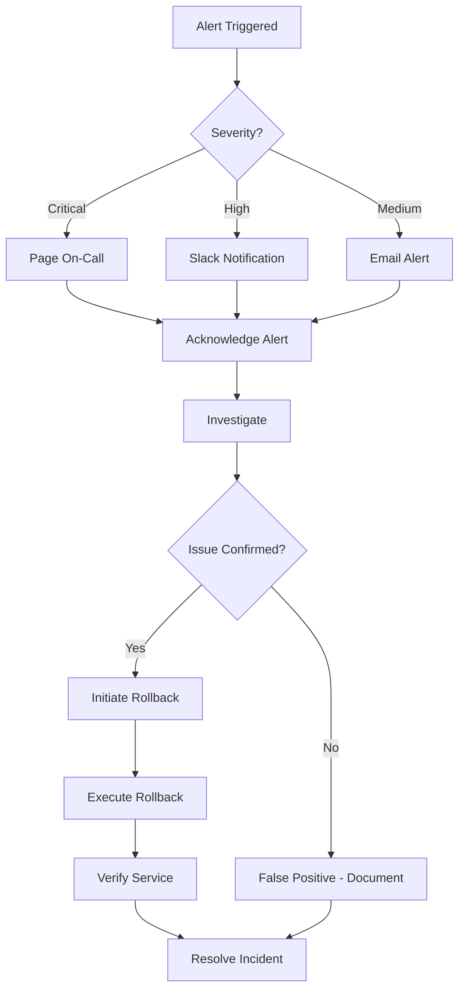

# Railway Monitoring Configuration Guide

## 🎯 Overview
This guide provides comprehensive monitoring setup for the Polish Finance Platform deployed on Railway. It covers metrics collection, alerting, and observability best practices.

---

## 📊 Monitoring Architecture

### Service Monitoring Stack

```
┌─────────────────────────────────────────────────────────────┐
│                    Railway Dashboard                         │
│  (Built-in Metrics, Logs, Health Checks)                    │
└──────────────────────┬──────────────────────────────────────┘
                       │
        ┌──────────────┼──────────────┬──────────────┐
        │              │              │              │
   ┌────▼────┐    ┌────▼────┐    ┌────▼────┐    ┌────▼────┐
   │Frontend │    │Backend  │    │Analysis │    │External │
   │Service  │    │Service  │    │Service  │    │Services │
   └────┬────┘    └────┬────┘    └────┬────┘    └────┬────┘
        │              │              │              │
        └──────────────┼──────────────┴──────────────┘
                       │
              ┌────────▼────────┐
              │   Health Checks │
              │   Custom Metrics│
              │   Log Analysis  │
              └─────────────────┘
```

---

## 📈 Built-in Railway Monitoring

### 1. Service Metrics

Railway automatically collects these metrics for each service:

**Resource Metrics:**
- **CPU Usage**: Percentage of CPU utilization
- **Memory Usage**: RAM consumption in MB/GB
- **Network I/O**: Incoming/outgoing traffic
- **Disk Usage**: Storage consumption

**Deployment Metrics:**
- **Build Time**: Duration of build process
- **Deploy Time**: Time to deploy and start
- **Restart Count**: Number of service restarts
- **Health Check Status**: Success/failure rate

**Access Metrics:**
- **Request Count**: Number of HTTP requests
- **Response Time**: Average response latency
- **Error Rate**: Percentage of failed requests
- **Status Codes**: Distribution of HTTP status codes

### 2. Accessing Metrics

**Via Railway Dashboard:**
1. Navigate to your project
2. Click on a service
3. Go to "Metrics" tab
4. Select time range (1h, 24h, 7d, 30d)
5. View graphs and statistics

**Via Railway CLI:**
```bash
# View service status
railway status

# Stream logs (includes metrics)
railway logs

# Get deployment information
railway deployments
```

---

## 🏥 Health Check Configuration

### Service Health Check Setup

Each service has specific health check endpoints configured in `railway-*.json`:

**Frontend Service** (`railway-frontend.json`):
```json
{
  "deploy": {
    "healthcheckPath": "/",
    "healthcheckTimeout": 100
  }
}
```

**Backend Service** (`railway-backend.json`):
```json
{
  "deploy": {
    "healthcheckPath": "/data",
    "healthcheckTimeout": 100
  }
}
```

**Analysis Service** (`railway-analysis.json`):
```json
{
  "deploy": {
    "healthcheckPath": "/api/analysis",
    "healthcheckTimeout": 100
  }
}
```

### Health Check Behavior

**Success Criteria:**
- HTTP status code: 200-299
- Response time: < timeout value (100ms)
- Service responds within startup grace period

**Failure Handling:**
- Railway marks deployment as "unhealthy"
- Automatic restart triggered (based on restart policy)
- Alerts sent to dashboard
- Previous healthy deployment kept running

### Custom Health Check Implementation

**Backend API Health Check** (`code/realtime_api_server.py`):
```python
def do_GET(self):
    if self.path == '/health':
        # Check data file accessibility
        try:
            data_file = self.get_data_file()
            with open(data_file, 'r') as f:
                json.load(f)
            
            self.send_response(200)
            self.send_header('Content-type', 'application/json')
            self.end_headers()
            
            health_status = {
                "status": "healthy",
                "timestamp": datetime.now().isoformat(),
                "data_file": "accessible",
                "service": "backend-api"
            }
            self.wfile.write(json.dumps(health_status).encode())
            
        except Exception as e:
            self.send_response(503)
            self.send_header('Content-type', 'application/json')
            self.end_headers()
            
            health_status = {
                "status": "unhealthy",
                "timestamp": datetime.now().isoformat(),
                "error": str(e),
                "service": "backend-api"
            }
            self.wfile.write(json.dumps(health_status).encode())
```

---

## 📊 Custom Metrics Collection

### 1. Application-Level Metrics

**Backend API Metrics** (`code/realtime_api_server.py`):
```python
import time
import json
from collections import defaultdict

class MetricsCollector:
    def __init__(self):
        self.request_count = defaultdict(int)
        self.response_times = []
        self.error_count = defaultdict(int)
        self.start_time = time.time()
    
    def record_request(self, endpoint):
        self.request_count[endpoint] += 1
    
    def record_response_time(self, duration_ms):
        self.response_times.append(duration_ms)
        # Keep only last 1000 measurements
        if len(self.response_times) > 1000:
            self.response_times.pop(0)
    
    def record_error(self, endpoint, error_type):
        self.error_count[f"{endpoint}:{error_type}"] += 1
    
    def get_metrics(self):
        uptime = time.time() - self.start_time
        avg_response_time = sum(self.response_times) / len(self.response_times) if self.response_times else 0
        
        return {
            "uptime_seconds": uptime,
            "total_requests": sum(self.request_count.values()),
            "requests_by_endpoint": dict(self.request_count),
            "average_response_time_ms": avg_response_time,
            "total_errors": sum(self.error_count.values()),
            "errors_by_type": dict(self.error_count),
            "timestamp": time.time()
        }

# Initialize metrics collector
metrics = MetricsCollector()

class RealTimeDataAPIHandler(BaseHTTPRequestHandler):
    def do_GET(self):
        start_time = time.time()
        
        try:
            # Record request
            metrics.record_request(self.path)
            
            # ... handle request ...
            
            # Record response time
            duration_ms = (time.time() - start_time) * 1000
            metrics.record_response_time(duration_ms)
            
        except Exception as e:
            # Record error
            metrics.record_error(self.path, type(e).__name__)
            raise
```

**Metrics Endpoint**:
```python
elif self.path == '/metrics':
    metrics_data = metrics.get_metrics()
    self.send_response(200)
    self.send_header('Content-type', 'application/json')
    self.end_headers()
    self.wfile.write(json.dumps(metrics_data).encode())
```

### 2. Business Metrics

**Data Freshness Monitoring**:
```python
def check_data_freshness():
    """Check if data is being updated"""
    try:
        data_file = get_data_file()
        file_mtime = os.path.getmtime(data_file)
        current_time = time.time()
        age_minutes = (current_time - file_mtime) / 60
        
        return {
            "data_file_age_minutes": age_minutes,
            "is_fresh": age_minutes < 60,  # Alert if older than 1 hour
            "last_updated": datetime.fromtimestamp(file_mtime).isoformat()
        }
    except Exception as e:
        return {
            "error": str(e),
            "is_fresh": False
        }
```

---

## 🚨 Alerting Configuration

### 1. Railway Native Alerts

**Setup via Railway Dashboard:**

1. **Navigate to Service** → **Settings** → **Alerts**
2. **Configure Alert Conditions:**

| Alert Type | Condition | Threshold | Action |
|------------|-----------|-----------|--------|
| CPU Usage | > | 80% | Email + Dashboard |
| Memory Usage | > | 85% | Email + Dashboard |
| Error Rate | > | 5% | Email + Dashboard |
| Restart Count | > | 3/hour | Email + Dashboard |
| Health Check Failures | > | 2 | Email + Dashboard |

3. **Notification Channels:**
   - Email notifications
   - Slack integration (via webhook)
   - Discord integration (via webhook)

### 2. Custom Alerting with Webhooks

**Create Alert Webhook Endpoint** (`code/alert_webhook.py`):
```python
from http.server import BaseHTTPRequestHandler
import json

class AlertWebhookHandler(BaseHTTPRequestHandler):
    def do_POST(self):
        if self.path == '/webhook/alerts':
            content_length = int(self.headers['Content-Length'])
            alert_data = json.loads(self.rfile.read(content_length))
            
            # Process alert
            self.process_alert(alert_data)
            
            self.send_response(200)
            self.end_headers()
    
    def process_alert(self, alert_data):
        """Process incoming alerts"""
        alert_type = alert_data.get('type')
        severity = alert_data.get('severity')
        message = alert_data.get('message')
        
        # Log alert
        print(f"🚨 ALERT [{severity}]: {alert_type} - {message}")
        
        # Send to external services
        self.send_to_slack(alert_data)
        self.send_to_pagerduty(alert_data)
    
    def send_to_slack(self, alert_data):
        """Send alert to Slack"""
        # Implementation for Slack webhook
        pass
    
    def send_to_pagerduty(self, alert_data):
        """Send alert to PagerDuty"""
        # Implementation for PagerDuty integration
        pass
```

---

## 📈 Monitoring Dashboard Setup

### 1. Railway Dashboard Customization

**Create Custom Views:**

1. **Project Overview Dashboard**
   - Add all services to single view
   - Configure time range: Last 24 hours
   - Key metrics: CPU, Memory, Request Rate

2. **Service-Specific Dashboards**
   - Frontend: Response times, error rates
   - Backend: Data freshness, API performance
   - Analysis: Computation time, pattern detection rate

3. **Alert Summary Dashboard**
   - Open alerts
   - Alert frequency trends
   - Resolution time metrics

### 2. External Monitoring Integration

**Prometheus Integration** (if using paid Railway plan):
```yaml
# prometheus.yml
scrape_configs:
  - job_name: 'railway-services'
    static_configs:
      - targets: 
        - 'backend-service.railway.internal:8000'
        - 'analysis-service.railway.internal:8001'
    metrics_path: '/metrics'
    scrape_interval: 30s
```

**Grafana Dashboard**:
```json
{
  "dashboard": {
    "title": "Railway Services Monitoring",
    "panels": [
      {
        "title": "Request Rate",
        "targets": [
          {
            "expr": "rate(http_requests_total[5m])",
            "legendFormat": "{{service}} - {{endpoint}}"
          }
        ]
      },
      {
        "title": "Response Time",
        "targets": [
          {
            "expr": "histogram_quantile(0.95, http_request_duration_seconds)",
            "legendFormat": "{{service}} - 95th percentile"
          }
        ]
      }
    ]
  }
}
```

---

## 📝 Log Management

### 1. Structured Logging

**Implement Structured Logging** (`code/logger.py`):
```python
import json
import time
from datetime import datetime

class StructuredLogger:
    def __init__(self, service_name):
        self.service_name = service_name
    
    def log(self, level, message, **kwargs):
        log_entry = {
            "timestamp": datetime.utcnow().isoformat(),
            "level": level,
            "service": self.service_name,
            "message": message,
            **kwargs
        }
        print(json.dumps(log_entry))
    
    def info(self, message, **kwargs):
        self.log("INFO", message, **kwargs)
    
    def warning(self, message, **kwargs):
        self.log("WARNING", message, **kwargs)
    
    def error(self, message, **kwargs):
        self.log("ERROR", message, **kwargs)
    
    def debug(self, message, **kwargs):
        self.log("DEBUG", message, **kwargs)

# Usage
logger = StructuredLogger("backend-api")
logger.info("Request received", endpoint="/data", method="GET")
logger.error("Data file not found", file_path="data/wig80_current_data.json")
```

### 2. Log Analysis Queries

**Common Log Queries:**

```bash
# Find all errors
grep '"level":"ERROR"' app.log

# Find slow requests (>1 second)
grep -E '"response_time_ms":\d{4,}' app.log

# Count requests by endpoint
grep '"endpoint"' app.log | jq -r '.endpoint' | sort | uniq -c

# Find data freshness issues
grep "data_file_age_minutes" app.log | jq '.data_file_age_minutes > 60'
```

---

## 🎯 Key Performance Indicators (KPIs)

### Service-Level KPIs

| KPI | Target | Alert Threshold | Measurement |
|-----|--------|-----------------|-------------|
| **Uptime** | 99.9% | < 99% | Railway status |
| **Response Time (p95)** | < 200ms | > 500ms | Custom metrics |
| **Error Rate** | < 1% | > 5% | Railway metrics |
| **Data Freshness** | < 15 min | > 60 min | Custom check |
| **Deployment Success** | > 95% | < 90% | Railway deployments |

### Business KPIs

| KPI | Target | Alert Threshold | Measurement |
|-----|--------|-----------------|-------------|
| **Active Users** | > 100 | < 10 | Frontend logs |
| **API Requests/min** | > 50 | < 10 | Backend metrics |
| **Analysis Requests** | > 20/hour | < 5/hour | Analysis metrics |
| **Pattern Detections** | > 10/day | < 2/day | Analysis logs |

---

## 🔍 Monitoring Checklist

### Daily Monitoring Tasks
- [ ] Review Railway dashboard for all services
- [ ] Check error rates and response times
- [ ] Verify data freshness (< 15 minutes)
- [ ] Review logs for anomalies
- [ ] Check alert inbox

### Weekly Monitoring Tasks
- [ ] Analyze performance trends
- [ ] Review resource utilization
- [ ] Check deployment success rates
- [ ] Update alerting thresholds if needed
- [ ] Review and tune alerts

### Monthly Monitoring Tasks
- [ ] Generate performance reports
- [ ] Analyze user behavior patterns
- [ ] Review and optimize costs
- [ ] Update monitoring dashboards
- [ ] Conduct capacity planning

---

## 🚨 Incident Response Integration

### Monitoring-Driven Incident Response



### Alert Severity Levels

**Critical (P1)**:
- Service completely down
- Data corruption detected
- Security breach
- **Action**: Page on-call, immediate response

**High (P2)**:
- Major functionality broken
- Error rate > 10%
- Performance degraded > 200%
- **Action**: Slack alert, respond within 15 min

**Medium (P3)**:
- Minor functionality affected
- Error rate 5-10%
- Performance degraded 50-200%
- **Action**: Email alert, respond within 1 hour

**Low (P4)**:
- Cosmetic issues
- Error rate < 5%
- Performance degraded < 50%
- **Action**: Log for review, respond within 24 hours

---

## 📚 Monitoring Best Practices

### 1. Alert Fatigue Prevention
- Set meaningful thresholds
- Use alert aggregation
- Implement alert deduplication
- Regular alert review and tuning

### 2. Observability
- Log structured data
- Include correlation IDs
- Trace requests across services
- Document metric meanings

### 3. Proactive Monitoring
- Monitor trends, not just thresholds
- Predict issues before they occur
- Capacity planning based on metrics
- Regular performance testing

### 4. Documentation
- Document all alerts and runbooks
- Keep monitoring architecture up to date
- Train team on monitoring tools
- Conduct regular incident reviews

---

**Last Updated**: 2025-11-08
**Version**: 1.0
**Maintained By**: DevOps Team
**Next Review**: 2025-12-08